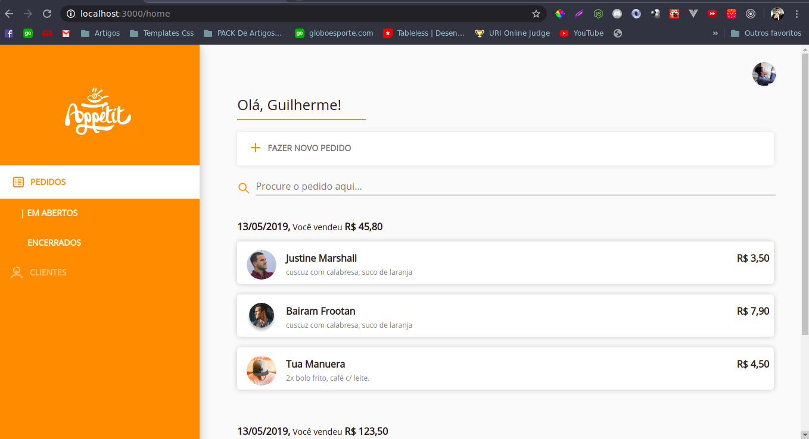
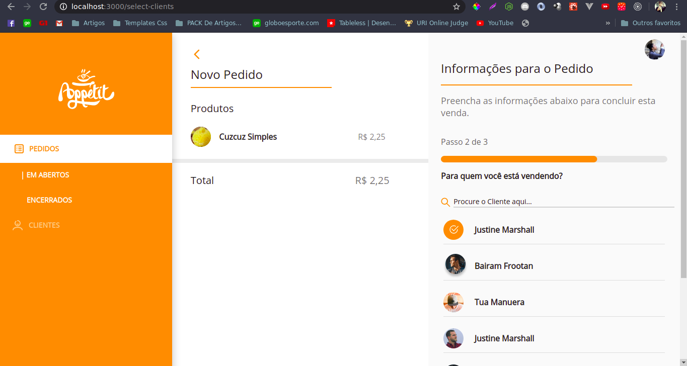

<h1 align="center">
    

</h1>

 Appetit is a web application(SPA) that was created with ReactJs. This Application aims to simulate a virtual coffe shot where it would be held,
Login, viewing the order list, order details, choosing a product for one or more customers and selecting order details such as payment status and date the order was placed. This project was bootstrapped with [Create React App](https://github.com/facebook/create-react-app).

  

 

  

 

  

 

  

 

  

## Features

- ⚛️ **React Js**: Lib JavaScript for building interfaces.
  - Use of lib styled-components for assist in css componentization and styles generally.
  - Use of ⚛️ React Hooks.
  - Use of MomentJs for assist date formate.
  - Use lib React Calendar.
  - Use lib React Icons.
  - Use lib react-router-dom transition between pages.
  - Use of componentization techniques to facilitate code reuse.
  - Use lib rc-progress for show progress bar.
  - Use of data fakes to simulate communication with an api.
  - Use of Css FlexBox and use media querys for metrics in mobile screen.

## Project architecture

The project is divided into src in some directories like:

- assets: image files that run locally in the project.
- pages: Pages of the web application, where it contains a root file and a style file.
- components: directory containing files that are reused in one or more parts of the project. Each component has its own style and data type eg Header, Customer List.
- styles: global application styles.
- utils: Utility functions such as formatting values ​​in reais, formatting the total value of the customer's purchase through their cart.
- services: place where a mock is made of an api through data trafficked in json, in this way the interface can make the call in these functions and obtain fakes data, simulating the communication with a real api.

Considering the image quality of svg image files, the free external service https://svgur.com/
this way the file is uploaded and the application requests the images via online url. As the service is free at some point, there is a noticeable slowness in loading the images hosted on it.

## Getting started

This project was bootstrapped with [Create React App](https://github.com/facebook/create-react-app).

## Available Scripts

To run the project locally you must install the nodejs environment on your machine followed by the dependency manager javascript yarn. If you prefer you can follow the tutotorial: https://riptutorial.com/node-js/example/29249/yarn-installation

First, in the project directory you can run:

### `yarn install`

In the project directory, you can run:

### `yarn start`

Runs the app in the development mode. 
Open [http://localhost:3000](http://localhost:3000) to view it in the browser.

The page will reload if you make edits. 
You will also see any lint errors in the console.

### `yarn build`

Builds the app for production to the `build` folder. 
It correctly bundles React in production mode and optimizes the build for the best performance.

The build is minified and the filenames include the hashes. 
Your app is ready to be deployed!

See the section about [deployment](https://facebook.github.io/create-react-app/docs/deployment) for more information.

### `yarn eject`

**Note: this is a one-way operation. Once you `eject`, you can’t go back!**

If you aren’t satisfied with the build tool and configuration choices, you can `eject` at any time. This command will remove the single build dependency from your project.

Instead, it will copy all the configuration files and the transitive dependencies (webpack, Babel, ESLint, etc) right into your project so you have full control over them. All of the commands except `eject` will still work, but they will point to the copied scripts so you can tweak them. At this point you’re on your own.

You don’t have to ever use `eject`. The curated feature set is suitable for small and middle deployments, and you shouldn’t feel obligated to use this feature. However we understand that this tool wouldn’t be useful if you couldn’t customize it when you are ready for it.

## Learn More

You can learn more in the [Create React App documentation](https://facebook.github.io/create-react-app/docs/getting-started).

To learn React, check out the [React documentation](https://reactjs.org/).

### Code Splitting

This section has moved here: https://facebook.github.io/create-react-app/docs/code-splitting

### Analyzing the Bundle Size

This section has moved here: https://facebook.github.io/create-react-app/docs/analyzing-the-bundle-size

### Advanced Configuration

This section has moved here: https://facebook.github.io/create-react-app/docs/advanced-configuration

### Deployment

This section has moved here: https://facebook.github.io/create-react-app/docs/deployment

### `yarn build` fails to minify

This section has moved here: https://facebook.github.io/create-react-app/docs/troubleshooting#npm-run-build-fails-to-minify

## Licence

This project is licensed under the MIT License - See the [license](https://opensource.org/licenses/MIT) for details.
